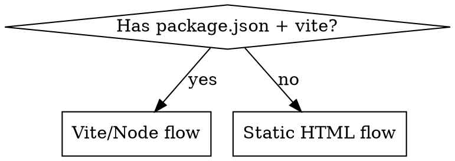

# Deploy to GitHub

## Overview

Push local code to GitHub and optionally publish it live via GitHub Pages. Covers two project types: **static HTML** (no build step) and **Vite/Node** (requires build + CI).

## Project Type Decision



---

## Static HTML Flow

### 1. Prepare `.gitignore`
```
.DS_Store
*.log
```

### 2. Initialize & first commit
```bash
git init
git add -A
git commit -m "feat: initial commit"
```

### 3. Create GitHub repo & push
```bash
gh repo create <repo-name> --public --source=. --remote=origin --push
```

### 4. Enable GitHub Pages (Settings → Pages)
- **Source:** Deploy from a branch
- **Branch:** `main` / `/ (root)`

Live URL: `https://<username>.github.io/<repo-name>/`

---

## Vite / Node Flow

### 1. Prepare `.gitignore`
```
node_modules/
dist/
.DS_Store
*.log
.env
.env.local
```

### 2. Set `base` in `vite.config.js`
```js
export default defineConfig({
  base: '/<repo-name>/',   // must match GitHub repo name
})
```

### 3. Initialize & first commit
```bash
git init
git add -A
git commit -m "feat: initial commit"
```

### 4. Create GitHub repo & push
```bash
gh repo create <repo-name> --public --source=. --remote=origin --push
```

### 5. Add GitHub Actions workflow
Create `.github/workflows/deploy.yml`:
```yaml
name: Deploy to GitHub Pages
on:
  push:
    branches: [main]
permissions:
  contents: read
  pages: write
  id-token: write
jobs:
  deploy:
    runs-on: ubuntu-latest
    environment:
      name: github-pages
      url: ${{ steps.deployment.outputs.page_url }}
    steps:
      - uses: actions/checkout@v4
      - uses: actions/setup-node@v4
        with:
          node-version: 20
          cache: npm
      - run: npm ci
      - run: npm run build
      - uses: actions/configure-pages@v4
      - uses: actions/upload-pages-artifact@v3
        with:
          path: dist
      - id: deployment
        uses: actions/deploy-pages@v4
```

### 6. Enable GitHub Pages
Settings → Pages → **Source: GitHub Actions**

---

## Ongoing Updates

```bash
git add -A
git commit -m "feat: <what changed>"
git push
```

For Vite projects, the Actions workflow auto-deploys on every push to `main`.

---

## Common Mistakes

| Problem | Fix |
|---------|-----|
| 404 on page refresh (Vite SPA) | Add `404.html` that redirects to `index.html`, or use HashRouter |
| Assets not loading after deploy | Check `base` in `vite.config.js` matches repo name exactly |
| `dist/` committed by accident | Add `dist/` to `.gitignore` before first commit |
| `node_modules` pushed | Remove with `git rm -r --cached node_modules` then re-commit |
| Pages shows old version | Wait ~2 min; check Actions tab for build errors |
| `gh` not authenticated | Run `gh auth login` first |

## Quick Check Before Push

```bash
git status          # verify staged files look correct
git log --oneline   # sanity check history
```

Never force-push to `main` unless explicitly requested.
